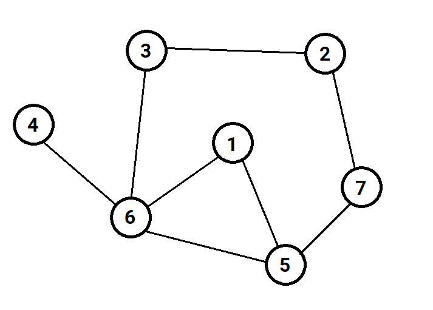

# Du lịch

Cho **n** thành phố và **m** con đường hai chiều giữa các thành phố. Mỗi còn đường gồm 2 số **u** và **v** (1 ≤ **u**, **v** ≤ **n, u** ≠ **v**) cho biết có con đường nối giữa thành phố **u** và thành phố **v**.

Anh Đức xuất phát từ thành phố **a** và muốn đi một tìm một đường đi để du lịch đảm bảo rằng anh Đức sẽ đi qua nhiều thành phố nhất có thể và quay về thành phố xuất phát. Hãy giúp anh Đức xác định số lượng thành phố nhiều nhất mà anh Đức có thể đi qua (bao gồm cả thành phố xuất phát).

**Dữ liệu**:

- Dòng đầu tiên chứa 2 số nguyên **n** và **m** (1 ≤ **n**, **m** ≤ 1000).

- **m** dòng tiếp theo, mỗi dòng chứa 2 số nguyên **u** và **v** (1 ≤ **u**, **v** ≤ **n, u** ≠ **v**).

- Dòng cuối cùng chứa số nguyên **a** (1 ≤ **a** ≤ **n**).

**Kết quả**: In ra số lượng thành phố nhiều nhất mà anh Đức có thể đi qua.

**Ví dụ**:
 <!-- 50% width image -->

    

| Input | Output |
|:-------|:--------|
| 7 8   4 6   6 1   6 3   6 5   5 7   7 2   3 2   5 1   6  | 6    |

Từ 6 có những cách đi thoã mãn là

- 6 -> 5 -> 1 -> 6
- 6 -> 1 -> 5 -> 6
- 6 -> 5 -> 7 -> 2 -> 3 -> 6
- 6 -> 1 -> 5 -> 7 -> 2 -> 3 -> 6
...

Trong số các cách đi trên, có 1 cách đi qua nhiều thành phố nhất là 6 thành phố.

Như vậy số lượng thành phố nhiều nhất mà anh Đức có thể đi qua là 6.

