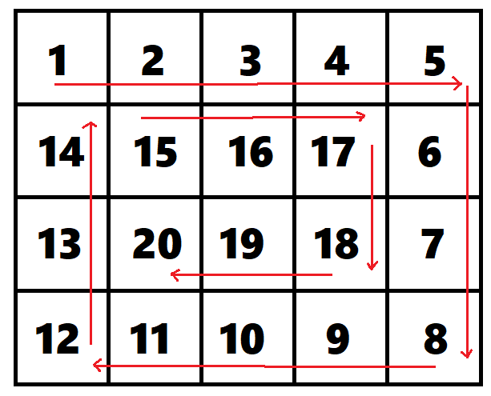

# Nối vòng tay lớn

Trong một buổi vui chơi, một nhóm bạn trẻ đã cùng nhau chơi một trò chơi rất thú vị. Trò chơi này có tên là "Nối vòng tay lớn". Trò chơi được tổ chức như sau: có **N** bạn trẻ đứng thành một vòng tròn, các bạn được đánh số từ **1** đến **N**. Số 2 sẽ đứng cạnh số 1 và 3, số 3 đứng cạnh số 2 và 4, số 4 đứng cạnh số 3 và 5, ... số N đứng cạnh số N-1 và 1.

Người quản trò sẽ lần lượt loại các bạn ra khỏi vòng tròn theo thứ tự như sau: bạn thứ nhất sẽ bị loại đầu tiên, cứ loại một người thì giữ lại một người, rồi lại loại một người, cứ như vậy cho đến khi chỉ còn lại một bạn duy nhất. Bạn này sẽ là người chiến thắng.

Cho biết số lượng bạn trẻ **N**. Hãy xác định xem bạn nào sẽ là người chiến thắng.

**Đầu vào**:

- Dòng đầu tiên là số nguyên dương **N** (1 ≤ N ≤ 1018)

**Đầu ra**:

- Một số nguyên dương là số thứ tự của bạn trẻ còn lại cuối cùng.

|Đầu vào|Đầu ra|
|:---|:---|
|5|2|

Những bạn trẻ được đánh số từ 1 đến 5 sẽ bị loại theo thứ tự: 1, 3, 5, 4. Cuối cùng chỉ còn lại bạn trẻ số 2.|

# Nối vòng tay lớn (Tiếp theo)

Trong một buổi vui chơi, một nhóm bạn trẻ đã cùng nhau chơi một trò chơi rất thú vị. Trò chơi này có tên là "Nối vòng tay lớn". Trò chơi được tổ chức như sau: có **N** bạn trẻ đứng thành một vòng tròn, các bạn được đánh số từ **1** đến **N**. Số 2 sẽ đứng cạnh số 1 và 3, số 3 đứng cạnh số 2 và 4, số 4 đứng cạnh số 3 và 5, ... số N đứng cạnh số N-1 và 1.

Người quản trò sẽ lần lượt loại các bạn ra khỏi vòng tròn theo thứ tự như sau: bạn thứ **K** sẽ bị loại đầu tiên, cứ loại một người thì giữ lại một người, rồi lại loại một người, cứ như vậy cho đến khi chỉ còn lại một bạn duy nhất. Bạn này sẽ là người chiến thắng.

Cho biết số lượng bạn trẻ **N**. Hãy xác định xem bạn nào sẽ là người chiến thắng.

**Đầu vào**:

- Dòng đầu tiên là số nguyên dương **N** và số nguyên dương **K** (1 ≤ K ≤ N ≤ 1018)

**Đầu ra**:

- Một số nguyên dương là số thứ tự của bạn trẻ còn lại cuối cùng.

|Đầu vào|Đầu ra|
|:---|:---|
|5 3|4|

Những bạn trẻ được đánh số từ 1 đến 5 sẽ bị loại theo thứ tự: 3, 5, 2, 1. Cuối cùng chỉ còn lại bạn trẻ số 4.|

# Ma trận xoắn ốc

Có một ma trận có kích thước **M** x **N** được điền các số nguyên dương từ 1 đến **M** x **N** theo thứ tự như sau:

Ví dụ **M = 4, N = 5**:

**Đầu vào**:

- Dòng đầu tiên là số nguyên dương **M** và số nguyên dương **N** (1 ≤ M, N ≤ 103)

**Đầu ra**:

- Một ma trận có kích thước **M** x **N** được điền các số nguyên dương từ 1 đến **M** x **N** theo thứ tự như trên.

**Ví dụ**:

|Đầu vào|Đầu ra|
|:---|:---|
|4 5|1 2 3 4 5 14 15 16 17 6 13 20 19 18 7 12 11 10 9 8|