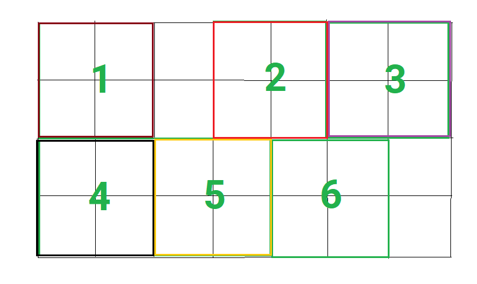

# Chọn 2 số nguyên có tổng lớn nhất

Cho dãy số nguyên a0, a1, ..., an-1. Hãy chọn 2 số nguyên trong dãy sao cho tổng của chúng là lớn nhất.

**Đầu vào**

- Dòng đầu tiên là số nguyên dương n (2 ≤ n ≤ 106).
- Dòng thứ hai là n số nguyên a0, a1, ..., an-1 (1 ≤ ai ≤ 109).

**Đầu ra**

- In ra tổng của cách chọn 2 số nguyên sao cho tổng của chúng là lớn nhất.

**Ví dụ**

|**Đầu vào** | **Đầu ra** |
|:--|:--|
| 5 1 5 2 4 3 | 9 |

**Giải thích**

- Chọn 2 số 5 và 4, tổng là 9. Đây là cách chọn 2 số, sao cho tổng lớn nhất.

**Giới hạn**

- 50% số test có n ≤ 1000.
- 50% còn lại số test có n ≤ 106.

Nếu là học viên, có thể nộp bài [Tại đây](https://oj.vnoi.info/problem/haizuka_tl001)

# Chọn 2 số để tích lớn nhất

Cho dãy số nguyên a0, a1, ..., an-1. Hãy chọn 2 số nguyên trong dãy sao cho tích của chúng là lớn nhất.

***Đầu vào**

- Dòng đầu tiên là số nguyên dương n (2 ≤ n ≤ 106).

- Dòng thứ hai là n số nguyên a0, a1, ..., an-1 (-104 ≤ ai ≤ 104).

**Đầu ra**

In ra tích của cách chọn 2 số nguyên sao cho tích của chúng là lớn nhất.

**Ví dụ 1**

|**Đầu vào** | **Đầu ra** |
|:--|:--|
| 5 1 5 2 4 3 | 20 |

**Ví dụ 2**

|**Đầu vào** | **Đầu ra** |
|:--|:--|
| 5 -6 5 2 4 -5 | 30 |

**Giới hạn**

- 50% số test có n ≤ 1000.
- 50% còn lại số test có n ≤ 106.

Nếu là học viên, có thể nộp bài [Tại đây](https://oj.vnoi.info/problem/haizuka_tl002)

# Chọn 3 số để tích lớn nhất

Cho dãy số nguyên a0, a1, ..., an-1. Hãy chọn 3 số nguyên trong dãy sao cho tích của chúng là lớn nhất.

**Đầu vào**

- Dòng đầu tiên là số nguyên dương n (3 ≤ n ≤ 106).

- Dòng thứ hai là n số nguyên a0, a1, ..., an-1 (-103 ≤ ai ≤ 103).

***Đầu ra**

In ra tích của cách chọn 3 số nguyên sao cho tích của chúng là lớn nhất.

***Ví dụ 1**

|**Đầu vào** | **Đầu ra** |
|:--|:--|
| 5 1 5 2 4 3 | 60 |

***Ví dụ 2**

|**Đầu vào** | **Đầu ra** |
|:--|:--|
| 5 -6 5 2 4 -5 | 150 |

**Giới hạn**

- 50% số test có n ≤ 100.
- 50% còn lại số test có n ≤ 106.

Nếu là học viên, có thể nộp bài [Tại đây](https://oj.vnoi.info/problem/haizuka_tl003)

# Chọn 4 số để tích lớn nhất

Cho dãy số nguyên a0, a1, ..., an-1. Hãy chọn 4 số nguyên trong dãy sao cho tích của chúng là lớn nhất.

**Đầu vào**

- Dòng đầu tiên là số nguyên dương n (4 ≤ n ≤ 106).

- Dòng thứ hai là n số nguyên a0, a1, ..., an-1 (-102 ≤ ai ≤ 102).

***Đầu ra**

In ra tích của cách chọn 4 số nguyên sao cho tích của chúng là lớn nhất.

***Ví dụ 1**

|**Đầu vào** | **Đầu ra** |
|:--|:--|
| 5 1 5 2 4 3 | 120 |

***Ví dụ 2**

|**Đầu vào** | **Đầu ra** |
|:--|:--|
| 5 -6 5 2 4 -5 | 600 |

**Giới hạn**

- 50% số test có n ≤ 100.
- 50% còn lại số test có n ≤ 106.

Nếu là học viên, có thể nộp bài [Tại đây](https://oj.vnoi.info/problem/haizuka_tl004)

# Chọn 5 số để tích lớn nhất

Cho dãy số nguyên a0, a1, ..., an-1. Hãy chọn 5 số nguyên trong dãy sao cho tích của chúng là lớn nhất.

**Đầu vào**

- Dòng đầu tiên là số nguyên dương n (5 ≤ n ≤ 106).

- Dòng thứ hai là n số nguyên a0, a1, ..., an-1 (-50 ≤ ai ≤ 50).

***Đầu ra**

In ra tích của cách chọn 4 số nguyên sao cho tích của chúng là lớn nhất.

***Ví dụ**

|**Đầu vào** | **Đầu ra** |
|:--|:--|
| 7 -10 -10 1 2 10 10 10 | 100000 |

**Giới hạn**

- 50% số test có n ≤ 100.
- 50% còn lại số test có n ≤ 106.

Nếu là học viên, có thể nộp bài [Tại đây](https://oj.vnoi.info/problem/haizuka_tl005)

# Trò chơi bập bênh

Trò bập bênh là một trò chơi dân gian rất phổ biến ở Việt Nam. Trò chơi này có thể có nhiều người chơi, mỗi người chơi đứng trên một bập bênh và cố gắng đẩy bập bênh của mình cao hơn so với bập bênh của người khác.

Nếu 2 bên của bập bênh có tổng cân nặng bằng nhau, bập bênh sẽ cân bằng và không di chuyển. 

Có 4 người tham gia trò chơi bập bênh, mỗi người đứng trên một bập bênh. Cân nặng của họ có cân nặng lần lượt là **A**, **B**, **C**, **D**. Hãy xác định xem có cách nào xếp 4 người chơi sao cho bập bênh ở trạng thái cân bằng không.

**Đầu vào**

- 4 số nguyên **A**, **B**, **C**, **D** (1 ≤ **A** ≤ **B** ≤ **C** ≤ **D** ≤ 100): cân nặng của 4 người chơi.

**Đầu ra**

- In ra "YES" nếu có cách xếp sao cho bập bênh cân bằng, ngược lại in ra "NO".

**Ví dụ 1**

| Đầu vào | Đầu ra |
|:--- | :--- |
| 1 2 3 4 | YES |

Có thể xếp như sau: 1 và 4 ở một bên, 2 và 3 ở một bên.

**Ví dụ 2**

| Đầu vào | Đầu ra |
| :--- | :--- |
| 1 2 3 5 | NO |

Nếu là học viên, có thể nộp bài [Tại đây](https://oj.vnoi.info/problem/haizuka_cpp01_03)

# Mua hàng siêu thị

Trong một siêu thị có n mặt hàng, mỗi mặt hàng có giá là ai. Bạn có m tiền. Hãy chọn ra nhiều mặt hàng nhất có thể mà không vượt quá số tiền m. Hãy in ra số mặt hàng bạn có thể mua được.

**Đầu vào**

- Dòng đầu tiên là số nguyên dương n (1 ≤ n ≤ 106).
- Dòng thứ hai là số nguyên dương m (1 ≤ m ≤ 1018).
- Dòng thứ ba là n số nguyên dương a0, a1, ..., an-1 (1 ≤ ai ≤ 109).

**Đầu ra**
In ra số mặt hàng bạn có thể mua được.

**Ví dụ**

|**Đầu vào** | **Đầu ra** |
|:--|:--|
| 5 10 1 3 3 10 5 | 3 |

***Giới hạn**

- 50% số test có n ≤ 1000.
- 50% còn lại số test có n ≤ 106.

Nếu là học viên, có thể nộp bài [Tại đây](https://oj.vnoi.info/problem/haizuka_tl006)

# Vận chuyển hàng hóa

Trong một kho hàng có n container, mỗi container có số lượng hàng hóa là ai.
Bạn cần có đủ số lượng hàng hóa là m. Hãy tính xem bạn cần di chuyển ít nhất bao nhiêu container để có đủ số lượng hàng hóa là m.

**Đầu vào**

- Dòng đầu tiên là số nguyên dương n (1 ≤ n ≤ 106).
- Dòng thứ hai là số nguyên dương m (1 ≤ m ≤ 1018).
- Dòng thứ ba là n số nguyên dương a0, a1, ..., an-1 (1 ≤ ai ≤ 109).

**Đầu ra**
In ra số container bạn cần di chuyển ít nhất để có đủ số lượng hàng hóa là m. Nếu không thể có đủ số lượng hàng hóa là m thì in ra -1.

***Ví dụ**

|**Đầu vào** | **Đầu ra** |
|:--|:--|
| 5 10 1 3 3 9 5 | 2 |

**Giải thích**

Chỉ cần di chuyển 2 container, đã có đủ số lượng hàng hóa là 10.

***Giới hạn**

- 50% số test có n ≤ 1000.
- 50% còn lại số test có n ≤ 106.

Nếu là học viên, có thể nộp bài [Tại đây](https://oj.vnoi.info/problem/haizuka_tl007)

# Xoá K chữ số trong số nguyên dương để được số lớn nhất

Cho một số nguyên dương n và một số nguyên dương k. Bạn cần xoá đúng k chữ số trong n sao cho số còn lại là lớn nhất có thể (không thay đổi thứ tự của các chữ số, chỉ được xoá). Hãy in ra số còn lại.

**Đầu vào**

- Dòng đầu tiên là số nguyên dương n (1 ≤ n ≤ 10100).
- Dòng thứ hai là số nguyên dương k (1 ≤ k < số chữ số của N).

**Đầu ra**

In ra số còn lại sau khi xoá k chữ số trong n.

**Ví dụ 1**

|**Đầu vào** | **Đầu ra** |
|:--|:--|
| 92744 3 | 97 |

**Ví dụ 2**

|**Đầu vào** | **Đầu ra** |
|:--|:--|
| 28491 3 | 91 |

** Giới hạn**

- 50% số test có n ≤ 106.
- 50% còn lại số test có n ≤ 10100.

Nếu là học viên, có thể nộp bài [Tại đây](https://oj.vnoi.info/problem/haizuka_tl008)

# Xoá K chữ số trong số nguyên dương để được số nhỏ nhất

Cho một số nguyên dương n và một số nguyên dương k. Bạn cần xoá đúng k chữ số trong n sao cho số còn lại là nhỏ nhất có thể (không thay đổi thứ tự của các chữ số, chỉ được xoá). Hãy in ra số còn lại.

**Đầu vào**

- Dòng đầu tiên là số nguyên dương n (1 ≤ n ≤ 10100).

- Dòng thứ hai là số nguyên dương k (1 ≤ k < số chữ số của N).

**Đầu ra**

In ra số còn lại sau khi xoá k chữ số trong n. Lưu ý là số còn lại không được có chữ số 0 ở đầu.

**Ví dụ 1**

|**Đầu vào** | **Đầu ra** |
|:--|:--|
| 28491 3 | 21 |

**Ví dụ 2**

|**Đầu vào** | **Đầu ra** |
|:--|:--|
| 92744 3 | 24 |

*Ví dụ 3*

|**Đầu vào** | **Đầu ra** |
|:--|:--|
| 910710 3 | 10 |

Nếu là học viên, có thể nộp bài [Tại đây](https://oj.vnoi.info/problem/haizuka_tl009)

# Chọn K số để tích lớn nhất

Cho dãy số nguyên a0, a1, ..., an-1. Hãy chọn K số nguyên trong dãy sao cho tích của chúng là lớn nhất.

***Đầu vào**

- Dòng đầu tiên là số nguyên dương n và k (2 ≤ k ≤ n ≤ 106).

- Dòng thứ hai là n số nguyên a0, a1, ..., an-1 (-109 ≤ ai ≤ 109).

**Đầu ra**

Do tích của K số nguyên có thể rất lớn, nên bạn chỉ cần in ra tổng của K số nguyên đó.

**Ví dụ:**

|**Đầu vào** | **Đầu ra** |
|:--|:--|
| 12 7 -10 -5 -4 -3 -1 1 1 2 3 3 4 4 | -11 |

7 số được chọn để tích lớn nhất là: -10 -5 -4 -3 3 4 4

Tổng của 7 số này là: -10 + -5 + -4 + -3 + 3 + 4 + 4 = -11

**Giới hạn**

- 50% số test có n ≤ 1000.
- 50% còn lại số test có n ≤ 106.

Nếu là học viên, có thể nộp bài [Tại đây](https://oj.vnoi.info/problem/haizuka_tl010)

# Chọn 2 số khác nhau để tổng lớn nhất

Cho dãy số nguyên a0, a1, ..., an-1. Hãy chọn 3 số nguyên **khác nhau** trong dãy sao cho tổng của chúng là lớn nhất.

Đề bài đảm bảo rằng luôn có 2 số khác nhau trong dãy.

**Đầu vào**

- Dòng đầu tiên là số nguyên dương n (2 ≤ n ≤ 106).
- Dòng thứ hai là n số nguyên a0, a1, ..., an-1 (1 ≤ ai ≤ 109).

**Đầu ra**

In ra tổng của cách chọn 2 số nguyên khác nhau sao cho tổng của chúng là lớn nhất.

**Ví dụ**

|**Đầu vào** | **Đầu ra** |
|:--|:--|
| 5 1 5 5 4 3 | 10 |

Nếu là học viên, có thể nộp bài [Tại đây](https://oj.vnoi.info/problem/haizuka_tl011)

# Tiếp tế quân nhu

Trong dịp 30 tháng 4. Một cựu chiến binh đã tổ chức một buổi tiệc lớn. Ông đã mời rất nhiều bạn bè đến tham dự. Trong lúc vui vẻ, ông kể về những kỷ niệm của mình trong thời kỳ kháng chiến chống Mỹ. Ông đã kể về những chuyến đi tiếp tế quân nhu cho các đồng đội của mình, và cũng có một bài toán thú vị về việc tiếp tế quân nhu mà ông đã gặp phải trong thời kỳ kháng chiến chống Mỹ. Trên quãng đường từ 1 đến n, có những trạm xăng, ông có thể dừng lại để đổ xăng. Với lượng xăng là **x**, ông có thể đi được **x** km. Có **m** trạm xăng, mỗi trạm xăng ở vị trí **p**i, luôn có trạm xăng ở vị trí 1. 

Ông có thể cần đổ xăng rất nhiều lần. Gọi **K** là số xăng lớn nhất mà ông phải đổ. Hãy tìm giá trị nhỏ nhất của **K**.

**Đầu vào**

- Dòng đầu tiên là số nguyên dương n (1 ≤ n ≤ 109) và m (1 ≤ m ≤ 106).
- Dòng thứ hai là m số nguyên dương p0, p1, ..., pm-1 (1 ≤ pi ≤ n). Không có 2 số nào giống nhau.

**Đầu ra**

In ra giá trị nhỏ nhất của K.

**Ví dụ 1**

|**Đầu vào** | **Đầu ra** |
|:--|:--|
| 10 4 1 2 5 9 | 4 |

**Giải thích:**

- Ở trạm xăng 1, ông đổ 4 lít, có thể đi được đến 5.
- Ở trạm xăng 5, ông đổ 4 lít, có thể đi được đến 9.
- Ở trạm xăng 9, ông đổ 1 lít, có thể đi được đến 10.

4 lít là số xăng lớn nhất mà ông phải đổ.

**Ví dụ 2**

|**Đầu vào** | **Đầu ra** |
|:--|:--|
| 10 4 1 2 5 8 | 3 |

Nếu là học viên, có thể nộp bài [Tại đây](https://oj.vnoi.info/problem/haizuka_tl012)

# Sửa chữa đường hành quân

Một chiếc xe quân sự đang đi trên một con đường. Chiếc xe này có thể leo được lên những con dốc có độ dốc không quá **x**.
Con đường này có n đoạn, mỗi đoạn có độ cao là **a**i. Nếu a[i] > a[i+1], thì xe sẽ di chuyển xuống dốc thoải mái. Nếu a[i] < a[i+1], thì xe sẽ di chuyển lên dốc, độ dốc là a[i+1] - a[i]. Nếu độ dốc lớn hơn **x**, thì xe không thể đi được. Để xem có thể di chuyển được cũng như tránh ngập lụt, người ta đã sẽ nâng cao độ cao của một số đoạn được. 

Tính tổng độ cao tối thiểu mà người ta cần nâng cao để chiếc xe có thể đi được từ đầu đến cuối con đường. Biết rằng ban đầu xe luôn ở đoạn đường đầu tiên.

**Đầu vào**

- Dòng đầu tiên là số nguyên dương n (1 ≤ n ≤ 106) và x (1 ≤ x ≤ 109).
- Dòng thứ hai là n số nguyên dương a0, a1, ..., an-1 (1 ≤ ai ≤ 109).

**Đầu ra**

In ra tổng độ cao tối thiểu mà người ta cần nâng cao để chiếc xe có thể đi được từ đầu đến cuối con đường.

**Ví dụ 1:**

|**Đầu vào** | **Đầu ra** |
|:--|:--|
| 5 2 1 2 1 6 5 | 3|

**Giải thích:**

Vì xe không thể leo từ 1 lên 6 được. Cần nâng đoạn được thứ 3 lên 3 đơn vị, độ cao sau khi nâng là 1, 2, 4, 6, 5.

**Ví dụ 2:**

|**Đầu vào** | **Đầu ra** |
|:--|:--|
| 5 2 1 4 1 6 7 | 4|

Cần nâng đoạn được thứ 3 lên 3 đơn vị, nâng đoạn 1 lên 1 đơn vị. Dãy độ cao sau khi nâng là 2, 4, 4, 6, 7.

**Ví dụ 3:**

|**Đầu vào** | **Đầu ra** |
|:--|:--|
| 5 2 1 1 2 4 7 | 2|

Cần nâng đoạn được thứ 3 và 4 lên 1 đơn vị. Dãy độ cao sau khi nâng là 1, 1, 3, 5, 7.

**Ví dụ 4:**

|**Đầu vào** | **Đầu ra** |
|:--|:--|
| 5 5 1 6 1 6 7 | 0|

**Giải thích:**
- Xe có thể đi được từ đầu đến cuối con đường mà không cần nâng đoạn nào cả.

Nếu là học viên, có thể nộp bài [Tại đây](https://oj.vnoi.info/problem/haizuka_tl013)

# Số may mắn và số xui xẻo

Người ta gọi một số xui xẻo khi trong số đó có chữ số 0. Ngược lại, nó được gọi là số may mắn khi trong số đó không có chữ số 0.

Nhập vào một số nguyên dương **x**. Hãy tìm số tự nhiên **x** nhỏ nhất sao cho
**n + x** là số may mắn

**Đầu vào**

- Một số nguyên dương n (0 ≤ n ≤ 1018).

**Đầu ra**
- In ra số tự nhiên x nhỏ nhất sao cho n + x là số may mắn.

**Ví dụ 1:**

|**Đầu vào** | **Đầu ra** |
|:--|:--|
| 900 | 11 |

900 + 11 = 911 không phải là số may mắn

**Ví dụ 2:**

|**Đầu vào** | **Đầu ra** |
|:--|:--|
| 208 | 3 |

Nếu là học viên, có thể nộp bài [Tại đây](https://oj.vnoi.info/problem/haizuka_tl014)

# Cắt giấy xếp hạc

Để xếp được một con hạc giấy, người ta cần có 1 tờ giấy hình vuông kích thước **k** x **k**.
Người ta có một tờ giấy hình chữ nhật kích thước **n** x **m**.
Bạn có thể cắt giấy thành các tờ hình vuông kích thước **k** x **k**. Hãy tính xem người ta có thể xếp được tối đa bao nhiêu con hạc giấy.

*Lưu ý: những phần giấy thừa không ghép lại được với nhau*

**Đầu vào**

- Dòng đầu tiên là số nguyên dương n và m (1 ≤ n, m ≤ 109).
- Dòng thứ hai là số nguyên dương k (1 ≤ k ≤ 109).

**Đầu ra**

- Một số nguyên dương là số lượng tối đa các tờ giấy hình vuông kích thước **k** x **k** có thể cắt ra từ tờ giấy hình chữ nhật kích thước **n** x **m**.   

**Ví dụ:**

|**Đầu vào** | **Đầu ra** |
|:--|:--|
| 7 4 2 | 6 |

**Giải thích:**

Hình chữ nhật kích thước 7 x 4 có thể cắt được 6 tờ giấy hình vuông kích thước 2 x 2.

Nếu là học viên, có thể nộp bài [Tại đây](https://oj.vnoi.info/problem/haizuka_tl015)

# Trò chơi bắn súng

Trong một trò chơi bắn súng, theo hình thức 100 người sẽ chia thành 25 đội, mỗi đội 4 người. Khi một người bị bắn, họ sẽ bị loại khỏi trò chơi, đội nào bị loại hết thì đội đó sẽ không còn người chơi nào nữa. Nếu một đội có tất cả người bị bắn, thì đội đó sẽ bị loại. Chỉ cần 1 người trong đội còn sống thì đội đó vẫn được xem như còn sống.

Tại một thời điểm, ban tổ chức chỉ biết được rằng hiện đang có **n** người còn sống trong trò chơi, nhưng không biết được là có bao nhiêu đội còn sống.

Ban tổ chức muốn biết tối đa và tối thiểu số đội còn sống trong trò chơi. Hãy giúp ban tổ chức tính toán.

**Đầu vào**

- Dòng đầu tiên là số nguyên dương n (1 ≤ n ≤ 100).

**Đầu ra**

- In ra 2 số nguyên dương là số đội còn sống tối thiểu và tối đa trong trò chơi.

**Ví dụ 1:**

|**Đầu vào** | **Đầu ra** |
|:--|:--|
| 3 | 1 3 |
**Giải thích:**

Hiện có 3 người còn sống, tối thiểu có 1 đội còn sống (đội đó có cả cả người). Tôi đa có 3 đội còn sống (mỗi đội có 1 người).

**Ví dụ 2:**

|**Đầu vào** | **Đầu ra** |
|:--|:--|
| 11 | 4 11 |

Nếu là học viên, có thể nộp bài [Tại đây](https://oj.vnoi.info/problem/haizuka_tl016)

# Số may mắn nhỏ nhất

Một số là số may mắn nếu nó chỉ chứa các chữ số 4 và 7.

Cho một số nguyên dương n. Hãy tìm số may mắn nhỏ nhất lớn hơn hoặc bằng n.

**Đầu vào**

- Một số nguyên dương n (1 ≤ n ≤ 1018).

**Đầu ra**
- In ra số may mắn nhỏ nhất lớn hơn hoặc bằng n.

**Ví dụ 1:**

|**Đầu vào** | **Đầu ra** |
|:--|:--|
| 32 | 44 |

**Ví dụ 2:**

|**Đầu vào** | **Đầu ra** |
|:--|:--|
| 69 | 74 |

**Ví dụ 3:**

|**Đầu vào** | **Đầu ra** |
|:--|:--|
| 97 | 444 |

**Giới hạn**
- 50% số test có n ≤ 106.
- 50% còn lại số test có n ≤ 1018.

Nếu là học viên, có thể nộp bài [Tại đây](https://oj.vnoi.info/problem/haizuka_tl017)

# Số may mắn lớn nhất

Một số là số may mắn nếu nó chỉ chứa các chữ số 4 và 7.

Cho một số nguyên dương n. Hãy tìm số may mắn lớn nhất nhỏ hơn hoặc bằng n.

**Đầu vào**

- Một số nguyên dương n (4 ≤ n ≤ 1018).

**Đầu ra**
- In ra số may mắn lớn nhất nhỏ hơn hoặc bằng n.

**Ví dụ 1:**

|**Đầu vào** | **Đầu ra** |
|:--|:--|
| 52 | 47 |

**Ví dụ 2:**

|**Đầu vào** | **Đầu ra** |
|:--|:--|
| 91 | 77 |

**Ví dụ 3:**

|**Đầu vào** | **Đầu ra** |
|:--|:--|
| 123 | 77 |

**Giới hạn**
- 50% số test có n ≤ 106.
- 50% còn lại số test có n ≤ 1018.

Nếu là học viên, có thể nộp bài [Tại đây](https://oj.vnoi.info/problem/haizuka_tl018)

# Búp bê Matryoshka

Ở đất nước Nga có một loại búp bê truyền thống rất đẹp, được gọi là Matryoshka. Búp bê này có hình dạng như sau: búp bê lớn nhất bên ngoài, bên trong có một búp bê nhỏ hơn, và cứ thế cho đến khi búp bê nhỏ nhất không còn búp bê nào bên trong nữa.

Trong một cuộc thi, người ta đã đưa ra một bài toán thú vị về búp bê Matryoshka. Người ta cho **N** búp bê Matryoshka, mỗi búp bê có kích thước là **a**i. Bạn hãy tạo thành một dãy búp bê Matryoshka có số lớp lớn nhất có thể. Số lớp chính là số búp bê có thể xếp vào nhau. Một búp bê có thể xếp vào trong một búp bê khác nếu kích thước của nó nhỏ hơn kích thước của búp bê đó.

**Đầu vào**

- Dòng đầu tiên là số nguyên dương n (1 ≤ n ≤ 106).
- Dòng thứ hai là n số nguyên dương a0, a1, ..., an-1 (1 ≤ ai ≤ 109).

**Đầu ra**

In ra số lớp lớn nhất có thể tạo thành từ các búp bê Matryoshka.

**Ví dụ 1:**

|**Đầu vào** | **Đầu ra** |
|:--|:--|
| 5 3 3 5 4 4 | 3 |

**Giải thích:**

- Búp bê nhiều lớp nhất có thể xếp sẽ có 3 lớp: Búp bê 3 sẽ xếp vào búp bê 4, búp bê 4 sẽ xếp vào búp bê 5. Lúc này 3 búp bên 3, 4, 5 sẽ tạo thành một dãy búp bê Matryoshka có số lớp lớn nhất là 3.

**Ví dụ 2:**

|**Đầu vào** | **Đầu ra** |
|:--|:--|
| 5 1 2 3 4 5 | 5 |

Nếu là học viên, có thể nộp bài [Tại đây](https://oj.vnoi.info/problem/haizuka_tl019)