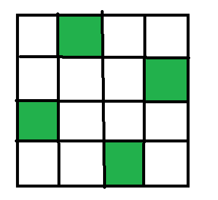
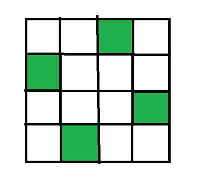

## Bài 1: Chọn bi

Có 3 loại bị 1, 2, 3. Mỗi loại bị có số lượng không giới hạn.

In ra tất cả các chọn 3 viên bị. 2 cách chọn gọi là khác nhau nếu có ít nhất một vị trí mà 2 cách chọn khác nhau.

**Input**

Không có input

**Output**

In ra tất cả các cách chọn 3 viên bị. Mỗi cách chọn in ra 3 số nguyên cách nhau bởi dấu cách. Các cách chọn không cần phải theo thứ tự tăng dần.

**Ví dụ**

| Input | Output |
|:-------|:--------|
|       | 1 1 1 1 1 2 1 1 3 1 2 1  1 2 2 1 2 3 1 3 1 1 3 2 1 3 3 2 1 1 2 1 2 2 1 3 2 2 1 2 2 2 2 2 3 2 3 1 2 3 2 2 3 3 3 1 1 3 1 2 3 1 3 3 2 1 3 2 2 3 2 3 3 3 1 3 3 2 3 3 3|

## Bài 2. Chọn bi (tiếp theo)

Có 3 loại bị 1, 2, 3. Mỗi loại bị có số lượng không giới hạn.

In ra tất cả các cách chọn **n** viên bị. 2 cách chọn gọi là khác nhau nếu có ít nhất một vị trí mà 2 cách chọn khác nhau.

**Input**

Một số nguyên **n** (1 ≤ **n** ≤ 10).

**Output**

In ra tất cả các cách chọn **n** viên bị. Mỗi cách chọn in ra **n** số nguyên cách nhau bởi dấu cách. Các cách chọn không cần phải theo thứ tự tăng dần.

**Ví dụ**

**Ví dụ 1**

| Input | Output |
|:-------|:--------|
| 1     | 1 2 3|

**Ví dụ 2**

| Input | Output |
|:-------|:--------|
| 2     | 1 1 1 2 1 3 2 1 2 2 2 3 3 1 3 2 3 3|

**Ví dụ 3**

| Input | Output |
|:-------|:--------|
| 3     | 1 1 1 1 1 2 1 1 3 1 2 1 1 2 2 1 2 3 1 3 1 1 3 2 1 3 3 2 1 1 2 1 2 2 1 3 2 2 1 2 2 2 2 2 3 2 3 1 2 3 2 2 3 3 3 1 1 3 1 2 3 1 3 3 2 1 3 2 2 3 2 3 3 3 1 3 3 2 3 3 3|

## Bài 3. Chọn bi (tiếp theo)

Có 3 loại bị 1, 2, 3. Mỗi loại bị có số lượng không giới hạn.

In ra tất cả các cách chọn **n** viên bị sao cho các viên bị có thú tự không giảm. 2 cách chọn gọi là khác nhau nếu có ít nhất một vị trí mà 2 cách chọn khác nhau.

**Input**

Một số nguyên **n** (1 ≤ **n** ≤ 10).

**Output**

In ra tất cả các cách chọn **n** viên bị sao cho các viên bị có thú tự không giảm. Mỗi cách chọn in ra **n** số nguyên cách nhau bởi dấu cách. Các cách chọn không cần phải theo thứ tự tăng dần.

**Ví dụ**

**Ví dụ 1**

| Input | Output |
|:-------|:--------|
| 1     | 1 2 3|

**Ví dụ 2**

| Input | Output |
|:-------|:--------|
| 2     | 1 1 1 2 1 3 2 2 2 3 3 3|

**Ví dụ 3**

| Input | Output |
|:-------|:--------|
| 3     | 1 1 1 1 1 2 1 1 3 1 2 2 1 2 3 1 3 3 2 2 2 2 2 3 2 3 3 3 3 3|

## Bài 4: Tổ hợp

Cho số nguyên dương **n** và **k**. Hãy in ra tất cả các cách chọn **k** phần tử từ tập hợp {1, 2, 3, ..., **n**}. 2 cách chọn gọi là khác nhau nếu có các phần tử khác nhau.

**Input**

Gồm 2 số nguyên **n** và **k** (1 ≤ **k** ≤ **n** ≤ 10).

**Output**

In ra tất cả các cách chọn **k** phần tử từ tập hợp {1, 2, 3, ..., **n**}. Mỗi cách chọn in ra **k** số nguyên cách nhau bởi dấu cách. Các cách chọn không cần phải theo thứ tự tăng dần.

**Ví dụ**

**Ví dụ 1**

| Input | Output |
|:-------|:--------|
| 3 2   | 1 2 1 3 2 3|

**Ví dụ 2**

| Input | Output |
|:-------|:--------|
| 4 3   | 1 2 3 1 2 4 1 3 4 2 3 4|

**Ví dụ 3**

| Input | Output |
|:-------|:--------|
| 5 2   | 1 2 1 3 1 4 1 5 2 3 2 4 2 5 3 4 3 5 4 5|

## Bài 5: Dãy nhị phân độ dài n

Cho số nguyên dương **n**. Hãy in ra tất cả các dãy nhị phân độ dài **n**. 2 dãy nhị phân gọi là khác nhau nếu có ít nhất một vị trí mà 2 dãy nhị phân khác nhau.

**Input**

Một số nguyên **n** (1 ≤ **n** ≤ 10).

**Output**

In ra tất cả các dãy nhị phân độ dài **n**. Mỗi dãy nhị phân in ra **n** số nguyên cách nhau bởi dấu cách. Các dãy nhị phân không cần phải theo thứ tự tăng dần.

**Ví dụ**

**Ví dụ 1**

| Input | Output |
|:-------|:--------|
| 2     | 00 01 10 11|

**Ví dụ 2**

| Input | Output |
|:-------|:--------|
| 3     | 000 001 010 011 100 101 110 111

## Bài 6: Phân tích số nguyên dương n

Cho số nguyên dương **n**. Hãy in ra tất cả các cách phân tích số nguyên dương **n** thành tổng các số nguyên dương.

**Input**

Một số nguyên **n** (1 ≤ **n** ≤ 20).

**Output**

In ra tất cả các cách phân tích số nguyên dương **n** thành tổng các số nguyên dương. Mỗi cách phân tích in ra một dòng. Các số trong mỗi cách phân tích cách nhau bởi dấu cách. Các cách phân tích không cần phải theo thứ tự tăng dần.

**Ví dụ**

**Ví dụ 1**

| Input | Output |
|:-------|:--------|
| 3     | 1 1 1 1 2 2 1 3|

**Ví dụ 2**

| Input | Output |
|:-------|:--------|
| 4     | 1 1 1 1 1 1 2 1 2 1 1 3 2 1 1 2 2 3 1 4|

## Bài 7: Phân tích số nguyên dương n (tiếp theo)

Cho số nguyên dương **n**. Hãy in ra tất cả các cách phân tích số nguyên dương **n** thành tổng các số nguyên dương sao cho các số nguyên dương này là dãy không giảm.

**Input**

Một số nguyên **n** (1 ≤ **n** ≤ 20).

**Output**

In ra tất cả các cách phân tích số nguyên dương **n** thành tổng các số nguyên dương sao cho các số nguyên dương này là dãy tăng dần. Mỗi cách phân tích in ra một dòng. Các số trong mỗi cách phân tích cách nhau bởi dấu cách. Các cách phân tích phải theo thứ tự không giảm.

**Ví dụ**

**Ví dụ 1**

| Input | Output |
|:-------|:--------|
| 3     | 1 + 1 + 1 1 + 2 3|

**Ví dụ 2**

| Input | Output |
|:-------|:--------|
| 5     | 1 + 1 + 1 + 1 + 1 1 + 1 + 1 + 2 1 + 1 + 3 1 + 2 + 2 1 + 4 2 + 3 5|

## Bài 8: Tổ hợp trong dãy

Cho dãy số nguyên dương **a1, a2, ..., an** và số nguyên dương **k**. Hãy in ra tất cả các cách chọn **k** phần tử từ dãy số đã cho. 2 cách chọn gọi là khác nhau nếu có các phần tử khác nhau.

**Input**

Dòng đầu tiên chứa 2 số nguyên **n** và **k** (1 ≤ **k** ≤ **n** ≤ 10).

Dòng thứ 2 chứa **n** số nguyên **a1, a2, ..., an** (1 ≤ **ai** ≤ 109).

**Output**

In ra tất cả các cách chọn **k** phần tử từ dãy số đã cho. Mỗi cách chọn in ra **k** số nguyên cách nhau bởi dấu cách. Các cách chọn không cần phải theo thứ tự tăng dần.

**Ví dụ**

**Ví dụ 1**

| Input | Output |
|:-------|:--------|
| 3 2    4 7 10 | 4 7 4 10 7 10|

**Ví dụ 2**

| Input | Output |
|:-------|:--------|
| 4 3    1 2 2 4 | 1 2 2 1 2 4 2 2 4|

## Bài 9: Hoán vị

Cho số nguyên dương **n**. Hãy in ra tất cả các hoán vị của tập hợp {1, 2, 3, ..., **n**}. 2 hoán vị gọi là khác nhau nếu có ít nhất một vị trí mà 2 hoán vị khác nhau.

**Input**

Một số nguyên **n** (1 ≤ **n** ≤ 10).

**Output**

In ra tất cả các hoán vị của tập hợp {1, 2, 3, ..., **n**}. Mỗi hoán vị in ra **n** số nguyên cách nhau bởi dấu cách. Các hoán vị không cần phải theo thứ tự tăng dần.

**Ví dụ**

**Ví dụ 1**

| Input | Output |
|:-------|:--------|
| 3     | 1 2 3 1 3 2 2 1 3 2 3 1 3 1 2 3 2 1|

**Ví dụ 2**

| Input | Output |
|:-------|:--------|
| 4     | 1 2 3 4  1 2 4 3  1 3 2 4  1 3 4 2  1 4 2 3  1 4 3 2  2 1 3 4  2 1 4 3  2 3 1 4  2 3 4 1  2 4 1 3  2 4 3 1  3 1 2 4  3 1 4 2  3 2 1 4  3 2 4 1  3 4 1 2  3 4 2 1  4 1 2 3  4 1 3 2  4 2 1 3  4 2 3 1  4 3 1 2  4 3 2 1|

## Bài 10: Sinh chỉnh hợp

Cho số nguyên dương **n** và **k**. Hãy in ra tất cả các chỉnh hợp **k** của tập hợp {1, 2, 3, ..., **n**}. 2 chỉnh hợp gọi là khác nhau nếu có ít nhất một vị trí mà 2 chỉnh hợp khác nhau.

**Input**

Gồm 2 số nguyên **n** và **k** (1 ≤ **k** ≤ **n** ≤ 10).

**Output**

In ra tất cả các chỉnh hợp **k** của tập hợp {1, 2, 3, ..., **n**}. Mỗi chỉnh hợp in ra **k** số nguyên cách nhau bởi dấu cách. Các chỉnh hợp không cần phải theo thứ tự tăng dần.

**Ví dụ**

**Ví dụ 1**

| Input | Output |
|:-------|:--------|
| 3 2   | 1 2 1 3 2 1 2 3 3 1 3 2|

**Ví dụ 2**

| Input | Output |
|:-------|:--------|
| 4 3   | 1 2 3 1 2 4 1 3 2 1 3 4 1 4 2 1 4 3 2 1 3 2 1 4 2 3 1 2 3 4 2 4 1 2 4 3 3 1 2 3 1 4 3 2 1 3 2 4 3 4 1 3 4 2 4 1 2 4 1 3 4 2 1 4 2 3 4 3 1 4 3 2|

## Bài 11: Bài toán N quân hậu

Cho số nguyên dương **n**. Hãy in ra tất cả các cách xếp **n** quân hậu trên bàn cờ **nxn** sao cho không có 2 quân hậu nào ăn được nhau. 2 cách xếp gọi là khác nhau nếu có ít nhất một vị trí mà 2 cách xếp khác nhau.

**Input**

Một số nguyên **n** (1 ≤ **n** ≤ 10).

**Output**

In ra tất cả các cách xếp **n** quân hậu trên bàn cờ **nxn** sao cho không có 2 quân hậu nào ăn được nhau. Mỗi cách xếp in ra **n** số nguyên cách nhau bởi dấu cách thể hiện vị trí của quân hậu trên mỗi hàng. Nếu không có cách xếp nào thì in ra "NO SOLUTION".

**Ví dụ**

**Ví dụ 1**

| Input | Output |
|:-------|:--------|
| 1     | 1|

**Ví dụ 2**

| Input | Output |
|:-------|:--------|
| 2     | NO SOLUTION|

**Ví dụ 3**

| Input | Output |
|:-------|:--------|
| 4     | 2 4 1 3 3 1 4 2|

Cách 1:

Cách 2:

## Bài 12: Chuỗi ngoặc đúng

Một chuỗi **s** được gọi là chuỗi ngoặc đúng nếu

- **s** là chuỗi rỗng
- **s** là chuỗi dạng **(s1)** với **s1** là chuỗi ngoặc đúng
- **s** là chuỗi dạng **s1s2** với **s1** và **s2** là chuỗi ngoặc đúng

Ví dụ: `(()())`, `()()()`, `((()))`, `()`, `((()()))`

Cho trước một số **n**. Hãy liệt kê tất cả các chuỗi ngoặc đúng có độ dài **2 * n**.

**Input**:

- Một dòng duy nhất chứa số nguyên **n** (1 ≤ **n** ≤ 10)

**Output**:

- Mỗi dòng chứa một chuỗi ngoặc đúng theo thứ tự từ điển tăng dần

**Ví dụ**:

**Ví dụ 1**:

| Input | Output |
|:-------|:--------|
| 1     | ()   |

**Ví dụ 2**:

| Input | Output |
|:-------|:--------|
| 2     | (()) ()()   |

## Bài 13: Số chuỗi con khác nhau

Cho một xâu ký tự **s**. Bạn có thể tách xâu **s** thành các xâu con. Hãy tìm cách tách sao cho số lượng xâu con khác nhau là lớn nhất.

**Input**:

- Một chuỗi S có độ dài không vượt quá 16.

**Output**:

- Một số nguyên là số lượng xâu con khác nhau lớn nhất.

**Ví dụ**:

| Input | Output |
|:------|:-------|
| abab  | 3      |

Một cách tích đó là "a", "b", "ab".

| Input | Output |
|:------|:-------|
| aaaaa | 2      |