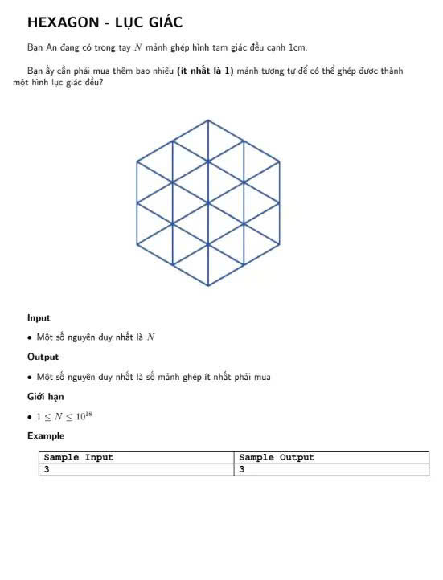

---------------------------
Tìm số chính phương m lớn nhất nhỏ hơn hoặc bằng N
(1 <= N)

Với dụ N = 13
Kết quả là 9

Với dụ N = 16
Kết quả là 16

--------------------------

Tìm số chính phương m lớn nhất nhỏ hơn hoặc bằng N
(1 <= N)

Với dụ N = 13
Kết quả là 9

Với dụ N = 16
Kết quả là 16

m = x * x
x * x <= n
x <= sqrt(n)
long long x = sqrt(n)

