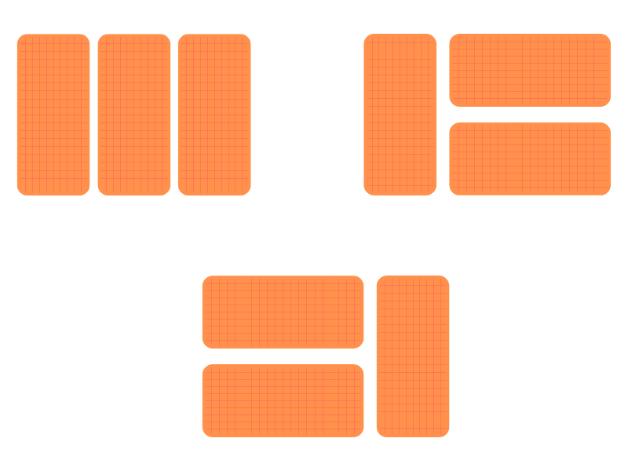

## Bài 1: Phần thưởng

Một công ty tổ chức một chương trình khuyến mãi. Công ty sẽ tặng phần thưởng cho những khách hàng mua hàng trong một ngày. Công ty có **n** phần quà để tặng, mỗi phần quà có giá trị là một số nguyên dương. Công ty cho phép bạn chọn bất kỳ các món quà nhưng với điều kiện không chọn hai món quà liên tiếp. Hãy tìm cách chọn các món quà sao cho tổng giá trị của các món quà chọn được là lớn nhất.

**Input:**

- Dòng đầu tiên chứa số nguyên **n** (1 ≤ **n** ≤ 10<sup>4</sup>)

- Dòng thứ hai chứa **n** số nguyên **a<sub>1</sub>, a<sub>2</sub>, ..., a<sub>n</sub>** (-10<sup>9</sup> ≤ **a<sub>i</sub>** ≤ 10<sup>9</sup>)

**Output:**

- Một số nguyên duy nhất là tổng giá trị lớn nhất của các món quà chọn được.

**Ví dụ:**

| Input | Output |
|:-------|:--------|
| 6<br> 1 -2 3 9 5 4 | 14 |

**Giải thích:**

Có thể chọn các món quà  1, 9 và 4, tổng giá trị là 14.

## Bài 2: Con chuột chũi

Một hang động rộng lớn được chia thành một lưới ô vuông kích thước **m** x **n**. Một con chuột bắt đầu từ ô (1, 1) và muốn đi đến ô (**m**, **n**). Con chuột có thể di chuyển sang bên phải hoặc xuống dưới mỗi lần. Mỗi ô có một số nguyên dương ghi trên đó, khi đi qua ô đó, con chuột sẽ nhận được số kẹo tương ứng. Hãy tìm cách để con chuột nhận được tổng số kẹo lớn nhất.

**Input:**

- Dòng đầu tiên chứa 2 số nguyên **m**, **n** (1 ≤ **n**, **m** ≤ 10<sup>4<sup>)

- **n** dòng tiếp theo, mỗi dòng chứa **m** số nguyên **a<sub>ij</sub>** (1 ≤ **a<sub>ij</sub>** ≤ 10<sup>9</sup>)

**Output:**

- Một số nguyên duy nhất là tổng số kẹo lớn nhất mà con chuột có thể nhận được.

**Ví dụ:**

| Input | Output |
|:-------|:--------|
| 3 3<br> 1 3 2<br> 2 4 3<br> 3 2 5 | 16 |

**Giải thích:**

Con chuột sẽ đi theo đường đi<br> 
(1, 1) → (1, 2) → (2, 2) → (2, 3) → (3, 3)<br>Và nhận được tổng số kẹo là 16.

```
3 3
1 3 2
2 4 3
3 2 5

0 0 0 0
0 1 4 6
0 3 8 11
0 6 10 16
```

## Bài 3: Tên trộm

Có nhiều món đồ giá trị trong một cửa hàng. Các một đồ được sắp xếp trên **m** hàng, mỗi hàng chứa **n** món đồ. Mỗi món đồ có giá trị là một số nguyên dương. Tên trộm xuất phát ở một ô ở cột 1 và kết thúc ở cột **n**. Tại ô **(x, y)** tên trộm có thể di chuyển qua ô **(x, y+1)**, **(x-1, y+1)** hoặc **(x+1, y+1)**. Hãy tìm cách để tên trộm có thể lấy được tổng giá trị lớn nhất của các món đồ mà tên trộm có thể lấy được.

**Input:**

- Dòng đầu tiên chứa 2 số nguyên **m**, **n** (1 ≤ **m**, **n** ≤ 10<sup>4<sup>)
- **m** dòng tiếp theo, mỗi dòng chứa **n** số nguyên **a<sub>ij</sub>** (1 ≤ **a<sub>ij</sub>** ≤ 10<sup>9</sup>)

**Output:**

- Một số nguyên duy nhất là tổng giá trị lớn nhất mà tên trộm có thể lấy được.

**Ví dụ:**

| Input | Output |
|:-------|:--------|
| 4 4<br> 9 3 2 1<br> 5 4  2 2<br> 3 2 5 6 <br> 1 2 20 9| 36 |

**Giải thích:**

Tên trộm sẽ đi theo đường đi<br> 
(2, 1) → (3, 2) → (4, 3) → (4, 4)<br>Và nhận được tổng giá trị là 36.


## Bài 4: Xây hàng rào

Một hàng rào các kích thước **2** x **n** được xây từ các viên gạch. Mỗi viên gạch có kích thước **2** x **1**. Hãy đếm số cách xây hàng rào sao cho hàng rào không có lỗ trống nào.

Kết quả có thể rất lớn, hãy in ra kết quả theo modulo 10<sup>9</sup> + 7.

**Input:**

- Dòng đầu tiên chứa số nguyên **n** (1 ≤ **n** ≤ 10<sup>18</sup>)

**Output:**

- Một số nguyên duy nhất là số cách xây hàng rào theo modulo 10<sup>9</sup> + 7.

**Ví dụ:**

**Ví dụ 1:**

| Input | Output |
|:-------|:--------|
| 3 | 3 |

**Giải thích:**

Có 3 cách xây hàng rào là:<br>


<p align="center">
  

**Ví dụ 2:**

| Input | Output |
|:-------|:--------|
| 4 | 5 |

**dp[k]: Số cách xây hàng rào có kích thước 2 x k**


## Bài 5: Xây hàng rào 2

Một hàng rào các kích thước **4** x **n** được xây từ các viên gạch. Mỗi viên gạch có kích thước **2** x **1**. Hãy đếm số cách xây hàng rào sao cho hàng rào không có lỗ trống nào.

Kết quả có thể rất lớn, hãy in ra kết quả theo modulo 10<sup>9</sup> + 7.

**Input:**

- Dòng đầu tiên chứa số nguyên **n** (1 ≤ **n** ≤ 10<sup>6</sup>)

**Output:**

- Một số nguyên duy nhất là số cách xây hàng rào theo modulo 10<sup>9</sup> + 7.

**Ví dụ:**

**Ví dụ 1:**

| Input | Output |
|:-------|:--------|
| 1 | 1 |

**Ví dụ 2:**

| Input | Output |
|:-------|:--------|
| 2 | 5 |

**Ví dụ 3:**

| Input | Output |
|:-------|:--------|
| 3 | 10 |

**Ví dụ 4:**

| Input | Output |
|:-------|:--------|


## Bài 6: Bài toán đổi tiền

Một ngân hàng có **n** loại tiền giấy với các mệnh giá khác nhau. Bạn cần đổi một số tiền **m** bằng cách sử dụng số tờ tiền ít nhất. Hãy xác định số tờ tiền cần thiết.

**Dữ liệu**: Vào từ thiết bị nhập chuẩn:

- Dòng đầu tiên chứa 2 số nguyên **n** và **m** (1 ≤ **n** ≤ 100, 1 ≤ **m** ≤ 10^6),

- Dòng thứ 2 chứa **n** số nguyên **a1**, **a2**, . . ., **an** (1 ≤ **ai** ≤ 10^6) - mệnh giá của các loại tiền.

**Kết quả**: Số tờ tiền ít nhất để đổi số tiền là **m**

**Ví dụ**:

**Ví dụ 1**:

| Input | Output |
|:-------|:--------|
|4 11<br> 1 2 3 4 | 3 |

**Ví dụ 2**:

| Input | Output |
|:-------|:--------|
|4 24<br> 1 2 8 10 | 3  |

**Ví dụ 3**:

| Input | Output |
|:-------|:--------|
|2 100<br> 10 1 | 10 |