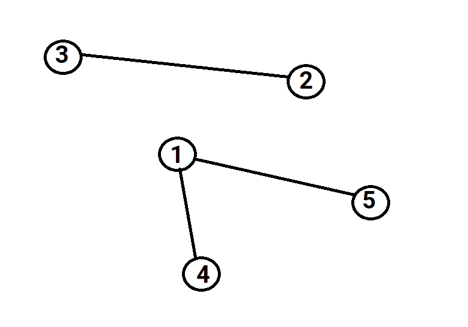
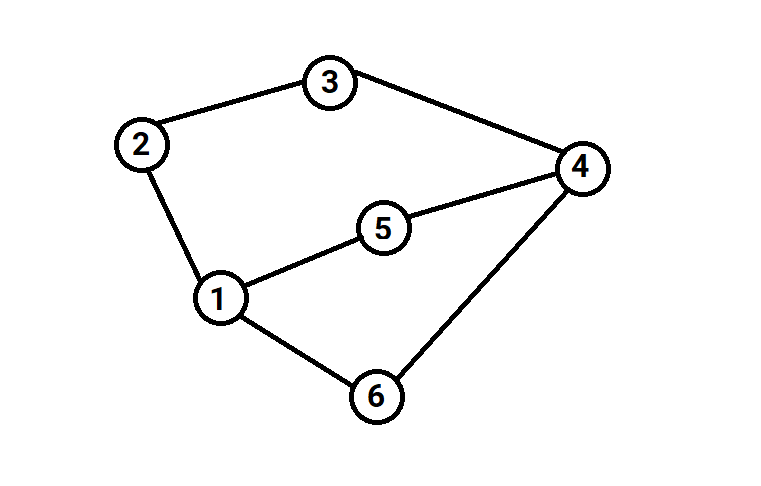

## Bài 1: Đường đi

Cho **n** thành phố và **m** con đường hai chiều giữa các thành phố. Mỗi còn đường gồm 2 số **u** và **v** (1 ≤ **u**, **v** ≤ **n, u** ≠ **v**) cho biết có con đường nối giữa thành phố **u** và thành phố **v**.

Hãy kiểm tra xem có thể đi từ thành phố **a** đến thành phố **b** không.
Nếu có in ra "YES", ngược lại in ra "NO".

**Dữ liệu**:

- Dòng đầu tiên chứa 2 số nguyên **n** và **m** (1 ≤ **n**, **m** ≤ 1000).
- **m** dòng tiếp theo, mỗi dòng chứa 2 số nguyên **u** và **v** (1 ≤ **u**, **v** ≤ **n, u** ≠ **v**).
- Dòng cuối cùng chứa 2 số nguyên **a** và **b** (1 ≤ **a**, **b** ≤ **n, a** ≠ **b**).

**Kết quả**: In ra "YES" hoặc "NO".

**Ví dụ**:

| Input | Output |
|:-------|:--------|
| 5 3   5 1   4 1   2 3   4 5   | YES    |

## Bài 2: Du lịch

Cho **n** thành phố và **m** con đường hai chiều giữa các thành phố. Mỗi con đường gồm 2 số **u** và **v** (1 ≤ **u**, **v** ≤ **n, u** ≠ **v**) cho biết có con đường bộ nối giữa thành phố **u** và thành phố **v**.

Đếm xem có bao nhiêu thành phố có thể đi đến từ thành phố **a**.

**Dữ liệu**:

- Dòng đầu tiên chứa 2 số nguyên **n** và **m** (1 ≤ **n**, **m** ≤ 1000).

- **m** dòng tiếp theo, mỗi dòng chứa 2 số nguyên **u** và **v** (1 ≤ **u**, **v** ≤ **n, u** ≠ **v**).

- Dòng cuối cùng chứa số nguyên **a** (1 ≤ **a** ≤ **n**).

**Kết quả**: In ra số lượng thành phố có thể đi đến từ thành phố **a**.

**Ví dụ**:

| Input | Output |
|:-------|:--------|
| 5 3   5 1   4 1   2 3   4   | 3    |

## Bài 3: Máy bay

Có **n** thành phố và **m** con đường hai chiều giữa các thành phố. Mỗi con đường gồm 2 số **u** và **v** (1 ≤ **u**, **v** ≤ **n, u** ≠ **v**) cho biết có con đường bộ nối giữa thành phố **u** và thành phố **v**.

Hải là người thích di chuyển bằng cách đi bộ bằng nhưng con đường. Tuy nhiên có những thành phố Hải không thể đi bộ tới được thì Hải sẽ đi bằng máy bay. Hãy đếm xem Hải cần đi ít nhất bao nhiêu chuyến máy bay để có thể đi tới tất cả các thành phố.

**Dữ liệu**:

- Dòng đầu tiên chứa 2 số nguyên **n** và **m** (1 ≤ **n**, **m** ≤ 1000).

- **m** dòng tiếp theo, mỗi dòng chứa 2 số nguyên **u** và **v** (1 ≤ **u**, **v** ≤ **n, u** ≠ **v**).

**Ví dụ**:

| Input | Output |
|:-------|:--------|
| 5 3   5 1   4 1   2 3  | 2    |

Có 2 cụm là (1, 4, 5) và (2, 3)

## Bài 4: Đường đi dài nhất

Có **n** thành phố và **m** con đường hai chiều giữa các thành phố. Mỗi con đường gồm 2 số **u** và **v** (1 ≤ **u**, **v** ≤ **n, u** ≠ **v**) cho biết có con đường bộ nối giữa thành phố **u** và thành phố **v**.

Hải xuất phát từ đỉnh a, và muốn đi du lịch nhiều thành phố nhất có thể. Hãy tìm đường đi dài nhất mà Hải có thể đi sao cho không đi qua thành phố nào nhiều hơn 1 lần.

**Dữ liệu**:

- Dòng đầu tiên chứa 2 số nguyên **n** và **m** (1 ≤ **n**, **m** ≤ 100).

- **m** dòng tiếp theo, mỗi dòng chứa 2 số nguyên **u** và **v** (1 ≤ **u**, **v** ≤ **n, u** ≠ **v**).

- Dòng cuối cùng chứa số nguyên **a** (1 ≤ **a** ≤ **n**).

**Kết quả**: In ra số lượng thành phố có thể đi đến từ thành phố **a**.

**Ví dụ**:

| Input | Output |
|:-------|:--------|
| 6 7   2 3   4 3   5 1   5 4   2 1   6 1   4 6  4   | 5    |

