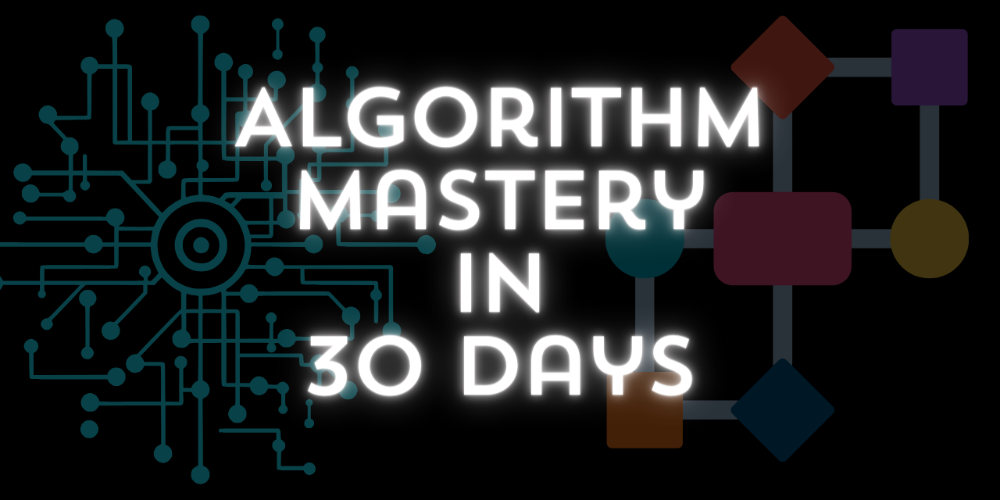

# Lộ trình học thuật toán từ cơ bản đến nâng cao

  

Lịch trình học thuật toán, mỗi buổi dự kiến khoảng 3 tiếng. Những buổi này chủ yếu sẽ dạy lí thuyết hoặc hướng dẫn bài tập, còn việc làm bài tập thì có thể làm ở nhà để tránh mất thời gian. Lịch trình chỉ là ước lượng.

|Nội dung|Số buổi|Trạng thái|
|---|:-:|:-:|
|- Nền tảng cơ bản|1|✅|
|- Một số thuật toán luyện tập tư duy ban đầu|3|✅|
|- Đệ quy - Thuật toán sắp xếp cơ bản - Sắp xếp nhanh|2|✅|
|- Các thuật toán tìm kiểm cơ bản - Tìm kiếm nhị phân|2||
|- Thuật toán vét cạn|2||
|- Quy hoạch động|4||
|- Thuật toán tham lam|2||
|- Thuật toán đồ thị|4||
|- Phân tích và tối ưu hóa thuật toán|5||

## 1. Nền tảng cơ bản:
   - **Ngôn ngữ lập trình**: Lựa chọn một ngôn ngữ, ví dụ như Python, Java, C++ hoặc Java Script và học cú pháp cơ bản của nó.
   - **Cấu trúc dữ liệu cơ bản**: Hiểu và luyện tập với các cấu trúc dữ liệu như mảng, danh sách liên kết, stack, queue, và cây.

## 2. Khởi đầu cơ bản:

#### Một số thuật toán luyện tập tư duy ban đầu
   - Một số thuật toán về số nguyên tố, sàng nguyên tố
   - Một số thuật toán về chuỗi, chuỗi đảo ngược, đối xứng
   - Một số thuật toán về toán học, công thức
   - Một số thuật toán về mảng, mảng 2 chiều, ... xử lí phần tử trong mảng.

#### Thuật toán tìm kiếm và sắp xếp cơ bản:
   - **Tìm kiếm tuần tự (Linear Search)**: Hiểu cách tìm kiếm phần tử trong một mảng dữ liệu một cách tuần tự.
   - **Tìm kiếm nhị phân (Binary Search)**: Hiểu cách tìm kiếm phần tử trong một mảng đã được sắp xếp bằng cách chia nhỏ mảng đó ra.
   - **Sắp xếp nổi bọt**: Luyện tập cách sắp xếp một mảng bằng cách hoán đổi các cặp phẩn tử sai vị trí liền kề
   - **Sắp xếp chọn (Selection Sort)**: Luyện tập cách sắp xếp một mảng bằng cách lựa chọn phần tử nhỏ nhất và đặt nó vào đúng vị trí.
   - **Sắp xếp chèn (Insertion Sort)**: Hiểu cách sắp xếp một mảng bằng cách chèn phần tử vào vị trí đúng trong một mảng con đã được sắp xếp.
   - **Sắp xếp nhanh (Quick Sort)**: Học cách sắp xếp một mảng dữ liệu bằng cách chia mảng thành các phần nhỏ hơn dựa trên phần tử pivot. (Sẽ học sau khi học đệ quy)

#### Thuật toán đệ quy:
   - **Thuật toán đệ quy**: Học cách giải quyết các bài toán bằng cách chia nhỏ thành các bài toán con nhỏ hơn và giải quyết chúng.

#### Thuật toán vét cạn:
   - **Thuật toán liệt kê (Enumeration Algorithm)**: Luyện tập với việc liệt kê tất cả các phương án có thể và chọn ra phương án tốt nhất.
   - **Thuật toán quay lui (Backtracking)**: Học cách giải quyết các bài toán kết hợp bằng cách thử từng giá trị cho từng phần tử một.

### 3. Thuật toán nâng cao:

#### Quy hoạch động:
   - **Thuật toán quy hoạch động**: Tìm công thức của bài toán lớn, sau đó chia thành các bài toán nhỏ.

#### Thuật toán tham lam:
   - **Thuật toán đóng băng (Freezing Algorithm)**: Học cách tối ưu hóa việc sắp xếp một tập hợp các phần tử sao cho chúng đóng băng càng sớm càng tốt.
   - **Thuật toán kích hoạt (Activation Algorithm)**: Luyện tập với việc tìm kiếm cách kích hoạt một tập hợp các sự kiện sao cho chúng xảy ra trong thời gian ngắn nhất.

#### Thuật toán đồ thị:
   - **Duyệt đồ thị**: Học về các thuật toán duyệt đồ thị như DFS và BFS và biết cách áp dụng chúng.
   - **Tìm đường đi ngắn nhất**: Học và luyện tập với thuật toán Dijkstra và Bellman-Ford để tìm đường đi ngắn nhất trong đồ thị.
   - **Tìm kiếm trong đồ thị**: Học và luyện tập với các thuật toán tìm kiếm trong đồ thị như thuật toán A*.

## 4. Rèn luyện kỹ năng giải quyết

Phần này sẽ đi song song. Trong quá trình học sẽ luyện tập với những bài giải thuật ở các web lập trình hoặc sẽ làm những bài tập mà Hải tự ra hoặc sưu tầm [Tại đây](https://github.com/zukahai/algotithm-training?tab=readme-ov-file#algotithm-training)

## 5. Phân tích và tối ưu hóa thuật toán:
   - **Phân tích bài toán**: Học các đọc đề, phân tích bài toán, liệt kê những cách giải của bài toán đó.
   - **Phân tích độ phức tạp**: Học cách phân tích độ phức tạp thời gian và không gian của thuật toán.
   - **Tối ưu hóa thuật toán**: Luyện tập cải thiện hiệu suất của thuật toán bằng cách tối ưu hóa mã và sử dụng kỹ thuật tối ưu hóa.
