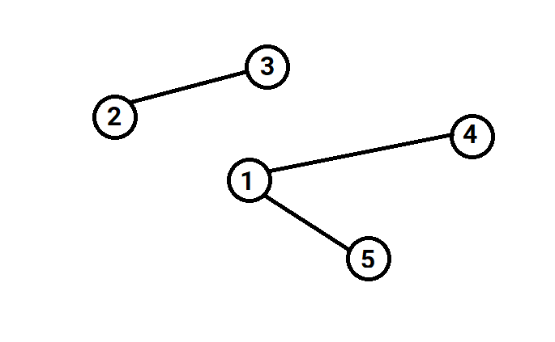

## Đường đi

Cho **n** thành phố và **m** con đường hai chiều giữa các thành phố. Mỗi còn đường gồm 2 số **u** và **v** (1 ≤ **u**, **v** ≤ **n, u** ≠ **v**) cho biết có con đường nối giữa thành phố **u** và thành phố **v**.

Hãy kiểm tra xem có thể đi từ thành phố **a** đến thành phố **b** không.
Nếu có in ra "YES", ngược lại in ra "NO".

**Dữ liệu**:

- Dòng đầu tiên chứa 2 số nguyên **n** và **m** (1 ≤ **n**, **m** ≤ 1000).
- **m** dòng tiếp theo, mỗi dòng chứa 2 số nguyên **u** và **v** (1 ≤ **u**, **v** ≤ **n, u** ≠ **v**).
- Dòng cuối cùng chứa 2 số nguyên **a** và **b** (1 ≤ **a**, **b** ≤ **n, a** ≠ **b**).

**Kết quả**: In ra "YES" hoặc "NO".

**Ví dụ**:

| Input | Output |
|:-------|:--------|
| 5 3 <br> 5 1 <br> 4 1 <br> 2 3 <br> 4 5   | YES    |

```cpp
#include <bits/stdc++.h>
using namespace std;

bool bk[1001][1001];
bool visited[1001];
int n;

void deQuy(int a) {
    visited[a] = true;
    for (int v = 1; v <= n; v++) {
        if (bk[a][v] == true && visited[v] != true) {
            deQuy(v);
        }
    }

}

int main() {
    int m;
    cin >> n >> m;
    
    for (int i = 0; i < m; i++) {
        int u, v;
        cin >> u >> v;
        bk[u][v] = true;
        bk[v][u] = true;
    }

    int a, b;
    cin >> a >> b;
    deQuy(a);
    if (visited[b] == true) {
        cout << "YES";
    } else {
        cout << "NO";
    }
}
```

## Du lịch

Cho **n** thành phố và **m** con đường hai chiều giữa các thành phố. Mỗi con đường gồm 2 số **u** và **v** (1 ≤ **u**, **v** ≤ **n, u** ≠ **v**) cho biết có con đường bộ nối giữa thành phố **u** và thành phố **v**.

Đếm xem có bao nhiêu thành phố có thể đi đến từ thành phố **a**.

**Dữ liệu**:

- Dòng đầu tiên chứa 2 số nguyên **n** và **m** (1 ≤ **n**, **m** ≤ 1000).

- **m** dòng tiếp theo, mỗi dòng chứa 2 số nguyên **u** và **v** (1 ≤ **u**, **v** ≤ **n, u** ≠ **v**).

- Dòng cuối cùng chứa số nguyên **a** (1 ≤ **a** ≤ **n**).

**Kết quả**: In ra số lượng thành phố có thể đi đến từ thành phố **a**.

**Ví dụ**:

| Input | Output |
|:-------|:--------|
| 5 3 <br> 5 1 <br> 4 1 <br> 2 3 <br> 4   | 3    |

## Máy bay

Đếm xem có bao nhiêu cụm, Mỗi cụm là những thành phố có thể đi đến với nhau.

**Dữ liệu**:

- Dòng đầu tiên chứa 2 số nguyên **n** và **m** (1 ≤ **n**, **m** ≤ 1000).

- **m** dòng tiếp theo, mỗi dòng chứa 2 số nguyên **u** và **v** (1 ≤ **u**, **v** ≤ **n, u** ≠ **v**).

- Dòng cuối cùng chứa số nguyên **a** (1 ≤ **a** ≤ **n**).

**Ví dụ**:

| Input | Output |
|:-------|:--------|
| 5 3 <br> 5 1 <br> 4 1 <br> 2 3  | 2    |



Có 2 cụm là (1, 4, 5) và (2, 3)