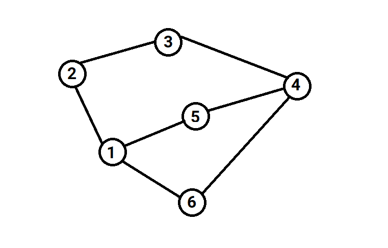

Cho **n** thành phố và **m** con đường hai chiều giữa các thành phố. Mỗi còn đường gồm 2 số **u** và **v** (1 ≤ **u**, **v** ≤ **n, u** ≠ **v**) cho biết có con đường nối giữa thành phố **u** và thành phố **v**.

Anh Đức muốn đi từ thành phố **a** đến thành phố **b** sao cho không có thành phố nào trùng lặp trên đường đi. Hãy giúp anh Đức xác định xem có bao nhiêu cách để anh Đức đi từ thành phố **a** đến thành phố **b**.

**Dữ liệu**:

- Dòng đầu tiên chứa 2 số nguyên **n** và **m** (1 ≤ **n**, **m** ≤ 1000).

- **m** dòng tiếp theo, mỗi dòng chứa 2 số nguyên **u** và **v** (1 ≤ **u**, **v** ≤ **n, u** ≠ **v**).

- Dòng cuối cùng chứa 2 số nguyên **a** và **b** (1 ≤ **a**, **b** ≤ **n**).

**Kết quả**: In ra số lượng cách để anh Đức đi từ thành phố **a** đến thành phố **b**.

**Ví dụ**:

| Input | Output |
|:-------|:--------|
| 6 7   2 1   2 3   1 6   4 5   3 4   6 4   2 4 | 3    |

Từ 2 đến 4 có 3 cách đi:
- 2 -> 1 -> 6 -> 4
- 2 -> 3 -> 4
- 2 -> 1 -> 5 -> 4